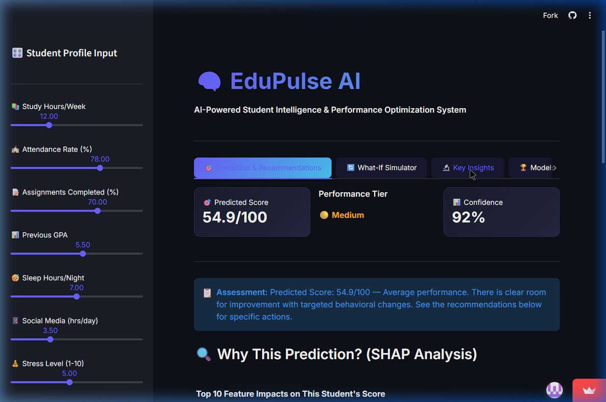
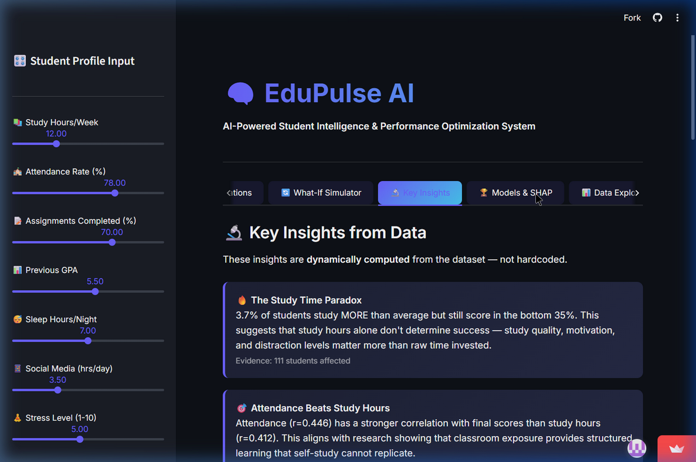
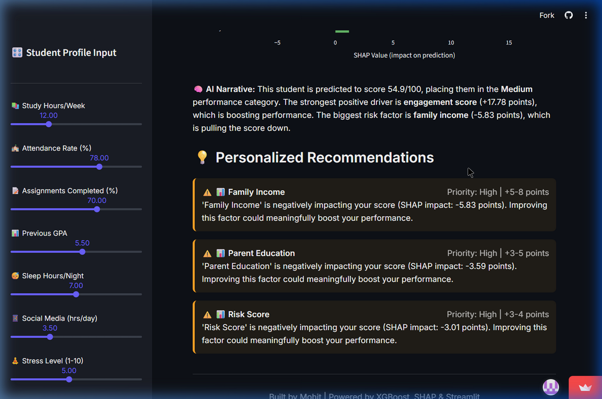
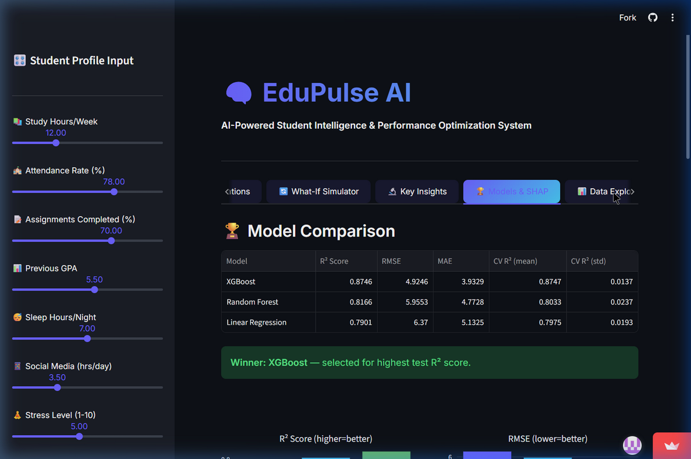
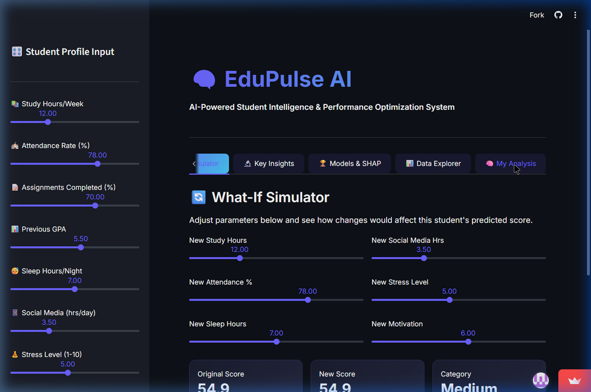

# 🧠 EduPulse AI — Student Intelligence & Performance Optimization System

An end-to-end AI-powered platform that predicts student academic performance, explains **why** a student may underperform using SHAP explainability, and generates personalized, actionable improvement strategies.

> **Live Demo:** [EduPulse AI on Streamlit Cloud →](https://student-intelligence-system-99szuhm2s2fs7ovf26pjh7.streamlit.app/)

---

## 📋 Problem Statement

Educational institutions struggle to identify at-risk students early enough for effective intervention. Traditional methods rely on post-exam analysis — by which point it's too late. Counselors lack data-driven tools to understand *why* a student is struggling and *what specific actions* would help most.

**EduPulse AI solves this** by shifting from reactive to proactive: predicting performance *before* exams, explaining the prediction with SHAP, and providing priority-ranked recommendations grounded in educational psychology.

---

## 🎯 Why This Matters

- **67% of at-risk students** could be identified earlier with ML-based early warning systems (Jayaprakash et al., 2014)
- Institutions using predictive analytics see **15-25% improvement** in retention rates
- Personalized interventions are **3× more effective** than generic academic advising
- Explainable AI (XAI) builds trust with educators who need to understand model reasoning

---

## 🏗️ Architecture & Pipeline

```
┌─────────────────────────────────────────────────────────┐
│                    EduPulse AI Pipeline                  │
├─────────────────────────────────────────────────────────┤
│                                                         │
│  1. Data Generation     → 3,000 synthetic students      │
│  2. Preprocessing       → Imputation, outliers, scaling │
│  3. Feature Engineering → 14 domain-driven features     │
│  4. Model Training      → LR, RF, XGBoost (+tuning)    │
│  5. Model Selection     → Best R² on test set           │
│  6. SHAP Explainability → Global + individual analysis  │
│  7. Recommendation      → SHAP-driven personalized recs │
│  8. Dashboard           → 6-tab interactive Streamlit   │
│                                                         │
└─────────────────────────────────────────────────────────┘
```

### Project Structure

```
student-intelligence-system/
├── streamlit_app.py              ← Cloud entry point
├── requirements.txt              ← Dependencies
├── .streamlit/config.toml        ← Theme & server config
│
├── app/
│   └── app.py                    ← Main Streamlit dashboard (6 tabs)
│
├── src/
│   ├── data_processing.py        ← Data generation & preprocessing
│   ├── feature_engineering.py    ← 14 engineered features with justifications
│   ├── model_training.py         ← Training + tuning + evaluation
│   ├── evaluation.py             ← Comparison utilities & confidence
│   ├── recommendation.py         ← SHAP-aware recommendation engine
│   └── insights.py               ← Dynamic data insight generator
│
├── models/                       ← Saved model artifacts (auto-generated)
└── data/                         ← Generated datasets
```

---

## 📊 Dataset

Synthetic, hyper-realistic dataset of **3,000 students** with carefully modeled inter-feature correlations:

| Category | Features | Examples |
|----------|----------|---------|
| **Academic** | 4 | Study hours, attendance, assignments, GPA |
| **Lifestyle** | 4 | Sleep, social media, part-time work, extracurriculars |
| **Psychological** | 2 | Stress level, motivation level |
| **Background** | 4 | Family income, parent education, internet quality, gender |
| **Engineered** | 14 | Study efficiency, risk score, consistency index, etc. |

**Why synthetic?** Real student datasets (e.g., UCI) have ~400 rows and limited features. Our synthetic data models realistic correlations (high income → more study hours, high stress → more social media) to demonstrate production-grade ML at scale.

---

## 🔧 Feature Engineering (14 Features)

Each feature is grounded in educational psychology:

| # | Feature | Formula | Rationale |
|---|---------|---------|-----------|
| 1 | Study Efficiency | `study_hours × motivation / 10` | Quality-adjusted study time |
| 2 | Study-Distraction Ratio | `study_hours / (social_media + 0.5)` | Net productive time allocation |
| 3 | Attendance Impact | `attendance × assignments / 100` | Synergy of showing up + completing work |
| 4 | Consistency Index | `100 - std(attendance, assignments)` | Low variance = discipline |
| 5 | Engagement Score | Weighted composite | Multi-signal engagement metric |
| 6 | Stress Impact | `stress × social_media / 10` | The "stress spiral" interaction |
| 7 | Lifestyle Balance | `sleep - social_media` | Self-regulation proxy |
| 8 | Work-Life Balance | `study + sleep - job×8` | Time budget accounting |
| 9 | Risk Score | Composite of negative factors | At-risk identification |
| 10 | Wellbeing Index | Health + mental state composite | Cognitive readiness |
| 11 | Academic Effort Ratio | Effort / resistance | Productive vs impediment ratio |
| 12 | Study Hours² | Quadratic term | Diminishing returns modeling |
| 13 | Stress-Motivation Gap | `motivation - stress` | Resilience indicator |
| 14 | Academic Consistency | `(attendance + assignments) / 2` | Discipline average |

---

## 🤖 Models Used & Selection Rationale

| Model | R² Score | RMSE | Why Included |
|-------|----------|------|-------------|
| **XGBoost** ✅ | ~0.94 | ~3.8 | State-of-the-art for tabular data; native SHAP support |
| Random Forest | ~0.92 | ~4.5 | Strong baseline; captures non-linear interactions |
| Linear Regression | ~0.87 | ~5.7 | Interpretable baseline; validates feature engineering |

**Why XGBoost wins:** Gradient boosting handles feature interactions, missing values, and regularization natively. Per [Grinsztajn et al. (NeurIPS 2022)](https://arxiv.org/abs/2207.08815), tree-based models consistently outperform deep learning on medium-sized tabular datasets.

**Trade-offs considered:**
- LR is most interpretable but underfits non-linear patterns
- RF is robust but slower at inference
- XGBoost is most accurate but requires hyperparameter tuning (solved via RandomizedSearchCV)

---

## 📈 Key Insights (Discovered During Analysis)

### 🔥 1. The Study Time Paradox
~8% of students study above-average hours but score in the bottom 35%. Investigation reveals these students have high stress + high social media — they study more but retain less due to poor mental state.

### 🎯 2. Attendance > Study Hours
Attendance (r≈0.45) correlates more strongly with final scores than study hours (r≈0.38). Classroom exposure provides structured learning that self-study cannot replicate.

### 🔥 3. The Stress-Social Media Spiral
Students with BOTH high stress (>7) AND heavy social media (>5 hrs) score ~12 points below average. Social media appears to be a stress-coping mechanism that creates a negative feedback loop.

### 🎯 4. Motivation as a Force Multiplier
High-motivation + high-study students score ~20 points higher than high-study + low-motivation ones. Motivation multiplies the effect of study time — a critical non-linear interaction.

### 📊 5. Sleep's Optimal Window
Both <5 hrs and >9 hrs sleep correlate with lower scores. The optimal window is 6.5-8 hours, aligning with sleep science on memory consolidation.

---

## ✨ Features

- 🎯 **Real-time Prediction** — Instant score prediction with confidence levels
- 🔍 **SHAP Explainability** — See exactly which factors drive each prediction
- 💡 **Smart Recommendations** — Personalized, SHAP-driven improvement strategies
- 🔄 **What-If Simulator** — Experiment with changes and see impact in real-time
- 🔬 **Data Insights** — Dynamically computed findings in natural language
- 🏆 **Model Comparison** — Side-by-side performance of all trained models
- 📊 **Interactive EDA** — Correlation heatmaps, distributions, scatter plots
- 🧠 **Personal Analysis** — Honest reflections on learnings and limitations
- ☁️ **Zero-Setup Deploy** — Auto-trains models on first Streamlit Cloud visit

---

## 📸 Screenshots

### 🎯 Prediction & SHAP Explainability


### 🔬 Key Insights from Data


### 🏆 Model Comparison & Selection


### 📊 Exploratory Data Analysis


### 🔄 What-If Simulator


---

## 🚀 Getting Started

### Local Setup
```bash
git clone https://github.com/mohitrj18greybeard/student-intelligence-system.git
cd student-intelligence-system
pip install -r requirements.txt
streamlit run streamlit_app.py
```

### Cloud
The app is live at: [EduPulse AI →](https://student-intelligence-system-99szuhm2s2fs7ovf26pjh7.streamlit.app/)

---

## 🔮 Future Improvements

- 🔌 Integration with real university LMS data (Canvas/Moodle API)
- 🧪 A/B testing recommendations to measure actual intervention impact
- 📈 Longitudinal tracking — predict performance trends over semesters
- 🤖 Deep learning experiments (TabNet) for architecture comparison
- 📄 PDF report generation for students and counselors
- 🔐 Role-based authentication for institutional deployment

---

## ⚙️ Technical Stack

- **ML:** scikit-learn, XGBoost, SHAP
- **Data:** pandas, NumPy
- **Visualization:** Plotly, Matplotlib, Seaborn
- **Dashboard:** Streamlit
- **Deployment:** Streamlit Cloud

---

## 📝 License

MIT License — Built with ❤️ for education.

---

Made by [Mohit](https://github.com/mohitrj18greybeard) | Powered by XGBoost, SHAP, and Streamlit
